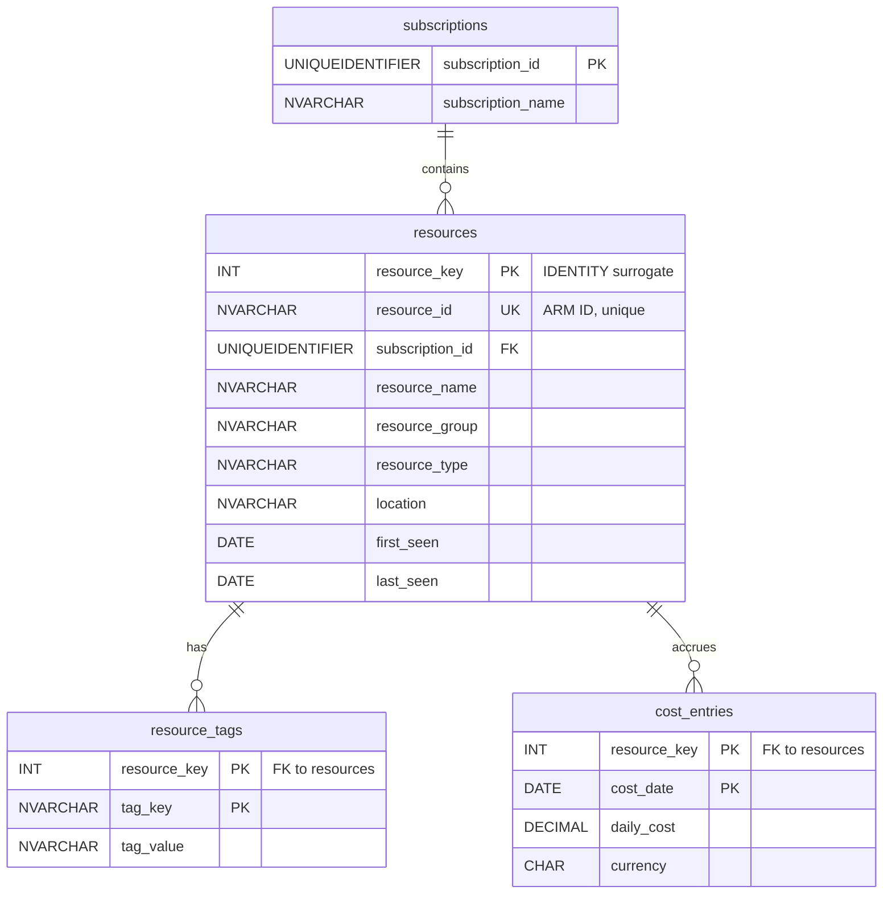

# Azure SQL Cost & Resource Analytics

An analytics database built on **Azure SQL (serverless)** over live data from my own Azure subscription — resource inventory, tags, and daily cost exports — answering the operational questions a real cloud team asks: *what does each resource group cost, what's untagged, and where is spend trending?*

This is the **data-layer chapter** of a three-repo portfolio:

| Repo                                                | Skill story                                                           |
| --------------------------------------------------- | --------------------------------------------------------------------- |
| [azure-webapp-iac](../../../azure-webapp-iac)       | Landing zone, networking, governance — Terraform + Azure DevOps CI/CD |
| [azure-container-iac](../../../azure-container-iac) | Containers, multi-environment promotion, managed identity             |
| **this repo**                                       | Schema design, intermediate SQL, query performance                    |

The infrastructure here is deliberately minimal (see [Design decisions](#design-decisions)) — the CI/CD and networking patterns are demonstrated in the other two repos. This one is about the SQL.

## Architecture



*(Full ER diagram with columns lands with the schema — Phase 1, Session 4.)*

## Roadmap

- [ ] **Phase 1 — Schema design & data load**
  - [x] Repo scaffolding
  - [x] Terraform: serverless Azure SQL with auto-pause
  - [x] Schema DDL (`objects/01_schema.sql`)
  - [ ] ER diagram + normalization decision notes
  - [ ] Data export (`az resource list` + Cost Management CSV)
  - [ ] Python load script (idempotent, env-var connection string)
- [ ] **Phase 2 — Core query library** (joins, aggregation, subqueries)
- [ ] **Phase 3 — Window functions & CTEs**
- [ ] **Phase 4 — Views, indexing & performance** (execution-plan before/after)
- [ ] **Phase 5 (optional) — Portfolio integration**

Phases land as pull requests; queries are committed incrementally as they're written.

## Repo structure

```
terraform/   Infrastructure — SQL server, serverless DB, firewall rule
objects/     Database internals — schema DDL, later views & stored procedures
queries/     Numbered analytical queries (.sql), each headed by the business question it answers
load/        Python script that parses the exports and loads the tables
docs/        Design notes too long for this README
data/        Raw exports — local only, gitignored (contains subscription details)
```

The rule of thumb: if running a file **changes what exists** in the database (`CREATE ...`), it's in `objects/`; if it **reads and returns results** (`SELECT`), it's in `queries/`.

## Design decisions

*(Written as decisions are made — the "why," not just the "what.")*

- **Serverless with auto-pause** — the database idles near $0 and resumes on connection. Unlike the landing zone repo, which is destroyed and rebuilt between sessions, this database *persists*: it accumulates months of cost data, which is what makes the trend queries (LAG, running totals) meaningful.
- **Client-IP firewall rule, not a private endpoint** — This database holds low-sensitivity data (my own subscription's inventory and costs) and is accessed interactively from my laptop many times per session. The landing zone repo demonstrates the private-endpoint pattern where it's warranted — an application-accessed database treated as production. Here, that isolation would add ~$10/month and force every query session through Bastion, for no meaningful risk reduction. One allowed client IP + SQL auth + TLS is the proportionate control. Different data, different access pattern, different answer.
- **Normalized to 3NF** — Tags live in their own table (resource_tags) rather than as columns or a JSON blob on resources, because a resource has many tags — first normal form's no-repeating-groups rule. Facts about a resource (name, type, location) live only on resources, keyed by the resource itself, so nothing depends on part of a key (2NF) or on another non-key column (3NF). Practical payoff: a tag rename is one row update, not a schema change, and cost rows never duplicate resource attributes — cost_entries stays narrow, which matters at daily-grain volume.
- **Surrogate key on 'resources'** - the original design used the ARM resource ID(NVARCHAR(400)) as the natural OK, with child tables keying on it. SQL Server warned that the resulting compsosite clustered index could reach 1,000 bytes - over the 900 byte limit - meaning inserts would fail for long enough resource IDs. Fix: resource_key INT IDENTITY as the PK that child tables reference, with the ARM ID retained under a UNIQUE constraint(non-clustered, 1,700 byte limit - 800 bytes fits). Side benefit: Phase 2's JOINs now compared 4-byte integers instead of 800-byte strings.

## Cost

Serverless General Purpose (0.5–1 vCore, auto-pause at 60 min, 2 GB max): effectively **~$0–2/month** at this usage pattern. Storage is the only always-on charge.

## Running it

*(Filled in as the pieces land.)*

1. `terraform apply` from `terraform/` — creates the server, database, and firewall rule
2. Run `objects/01_schema.sql` against the database
3. Export data: `az resource list --output json > data/inventory.json` + Cost Management CSV → `data/`
4. `python load/load_data.py` (connection string via `SQL_CONNECTION_STRING` env var)
