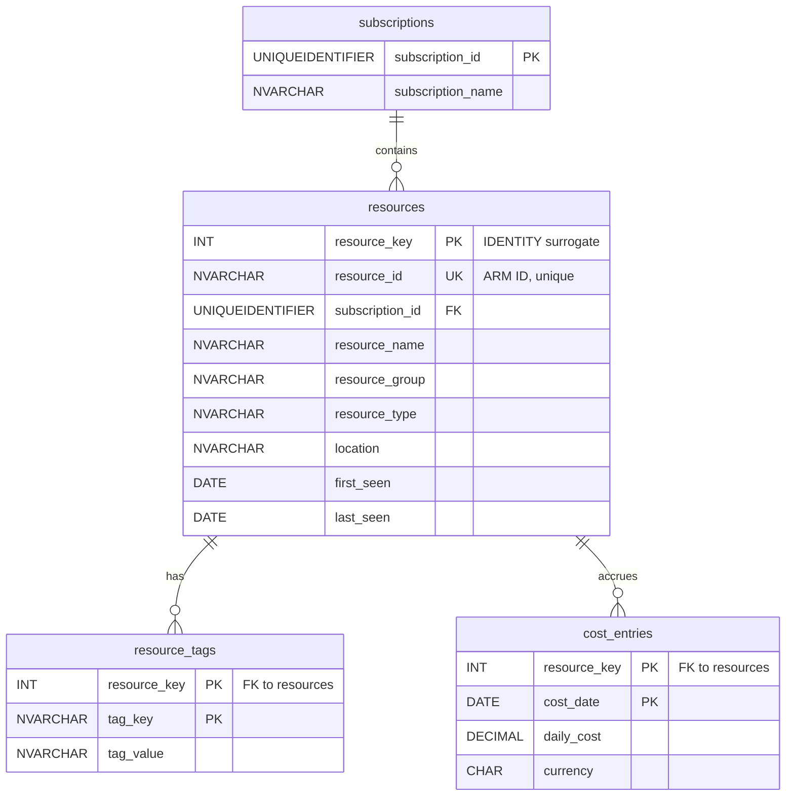
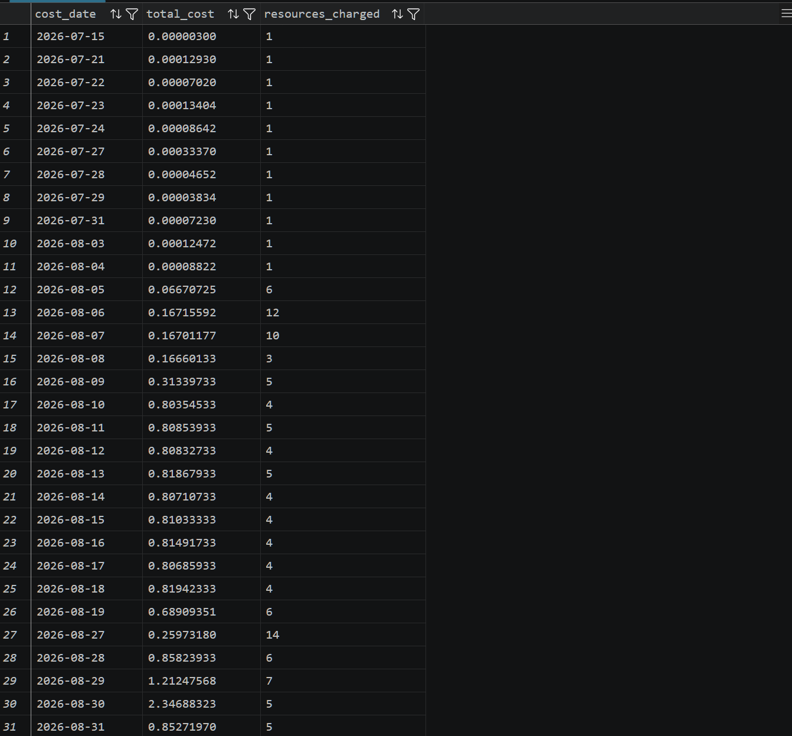

# Azure SQL Cost & Resource Analytics

An analytics database built on **Azure SQL (serverless)** over live data from my own Azure subscription — resource inventory, tags, and daily cost exports — answering the operational questions a real cloud team asks: *what does each resource group cost, what's untagged, and where is spend trending?*

This is the **data-layer chapter** of a three-repo portfolio:

| Repo                                                | Skill story                                                           |
| --------------------------------------------------- | --------------------------------------------------------------------- |
| [azure-webapp-iac](https://github.com/MollyMadel3ine/webapp-iac)       | Landing zone, networking, governance — Terraform + Azure DevOps CI/CD |
| [azure-container-iac](https://github.com/MollyMadel3ine/container-iac) | Containers, multi-environment promotion, managed identity             |
| **this repo**                                       | Schema design, intermediate SQL, query performance                    |

The infrastructure here is deliberately minimal (see [Design decisions](#design-decisions)) — the CI/CD and networking patterns are demonstrated in the other two repos. This one is about the SQL.

## Architecture



*(Full ER diagram with columns lands with the schema — Phase 1, Session 4.)*

## Repo structure

```
terraform/   Infrastructure — SQL server, serverless DB, firewall rule
objects/     Database internals — schema DDL, later views & stored procedures
queries/     Numbered analytical queries (.sql), each headed by the business question it answers
load/        Python script that parses the exports and loads the tables
docs/        Design notes too long for this README
data/        Raw exports — local only, gitignored (contains subscription details)
```

The rule of thumb: if running a file **changes what exists** in the database (`CREATE ...`), it's in `objects/`; if it **reads and returns results** (`SELECT`), it's in `queries/`.

## Design decisions

*(Written as decisions are made — the "why," not just the "what.")*

- **Serverless with auto-pause** — the database idles near $0 and resumes on connection. Unlike the landing zone repo, which is destroyed and rebuilt between sessions, this database *persists*: it accumulates months of cost data, which is what makes the trend queries (LAG, running totals) meaningful.
- **Client-IP firewall rule, not a private endpoint** — This database holds low-sensitivity data (my own subscription's inventory and costs) and is accessed interactively from my laptop many times per session. The landing zone repo demonstrates the private-endpoint pattern where it's warranted — an application-accessed database treated as production. Here, that isolation would add ~$10/month and force every query session through Bastion, for no meaningful risk reduction. One allowed client IP + SQL auth + TLS is the proportionate control. Different data, different access pattern, different answer.
- **Normalized to 3NF** — Tags live in their own table (resource_tags) rather than as columns or a JSON blob on resources, because a resource has many tags — first normal form's no-repeating-groups rule. Facts about a resource (name, type, location) live only on resources, keyed by the resource itself, so nothing depends on part of a key (2NF) or on another non-key column (3NF). Practical payoff: a tag rename is one row update, not a schema change, and cost rows never duplicate resource attributes — cost_entries stays narrow, which matters at daily-grain volume.
- **Surrogate key on 'resources'** - the original design used the ARM resource ID(NVARCHAR(400)) as the natural OK, with child tables keying on it. SQL Server warned that the resulting compsosite clustered index could reach 1,000 bytes - over the 900 byte limit - meaning inserts would fail for long enough resource IDs. Fix: resource_key INT IDENTITY as the PK that child tables reference, with the ARM ID retained under a UNIQUE constraint(non-clustered, 1,700 byte limit - 800 bytes fits). Side benefit: Phase 2's JOINs now compared 4-byte integers instead of 800-byte strings.
- **Every aggregate gets a control-total check.** The first run of query 04 returned $244.78 against a true total of $14.40 — exactly 17×. The multiplier was the fingerprint: a two-character alias typo in the LEFT JOIN's ON clause (ce.resource_key where rt.resource_key belonged) left the tag rows unanchored, cross-joining all 17 project-tag rows to every cost row. Legal SQL, plausible output shape, caught only because the bucket totals were checked against the known table sum.
- **CTEs vs. subqueries (query 03 refactor)** Query 03 originally answered "which resources dropped out of inventory, and what did they cost?" with a scalar subquery embedded in the WHERE clause. It was refactored into layered CTEs (latest_inventory → stale_resources → final aggregation) — the commit diff shows the full before/after.
The trade-off:
Readability. The subquery version reads inside-out — you dig to the innermost parentheses first, then work back outward. The CTE version reads top-to-bottom as named steps, in the same order you'd explain the logic to a teammate. For a query this small the gain is modest; it compounds quickly at two or three levels of nesting, where subqueries become unreadable while CTE chains grow linearly.
Performance is a wash. SQL Server inlines simple CTEs into the same execution plan as the equivalent subquery. This was a readability decision, not an optimization — both versions were run against the full dataset and returned identical results.

## Findings

Results in this section come from the queries in `queries/`, run against
the loaded schema. Small aggregated excerpts are shown; raw exports are
not committed.

### 1. The week that doesn't exist — IaC habits, visible in billing data

`02_daily_trend.sql` shows a steady ~$0.81/day baseline through mid-August,
then seven days (Aug 20–26) that produce no rows at all:

| cost_date  | total_cost | resources_charged |
|------------|-----------:|------------------:|
| 2026-08-18 | 0.81942333 |                 4 |
| 2026-08-19 | 0.68909351 |                 6 |
| 2026-08-27 | 0.25973180 |                14 |
| 2026-08-28 | 0.85823933 |                 6 |



This isn't missing data — the environments were destroyed between work
sessions (`terraform destroy`). The rebuild is visible on Aug 27: 14
resources charging partial-day amounts. A note on the query itself:
`GROUP BY` only produces rows for dates that have data, so a trend query
silently hides gaps — the absence was caught by reading the date column,
not by the query flagging it.

### 2. Scale-to-zero, measured

`01_cost_by_resource_group.sql` puts a number on the container project's
scale-to-zero design. Same six resources, same date range:

| resource_group        | total_cost | resource_count |
|-----------------------|-----------:|---------------:|
| rg-container-demo-prod | 9.14108565 |              6 |
| rg-container-demo-dev  | 0.00920276 |              6 |

The always-on prod environment costs ~1,000× the scale-to-zero dev
environment. The dev totals are also the DECIMAL(14,8) precision fix
paying off — under the original DECIMAL(x,4) column, these micro-charges
rounded to zero and the comparison would have been invisible.

### 3. The orphan audit returns zero rows — and that's the finding

`03_orphaned_spend.sql` looks for resources with cost history that missed
the latest inventory. Despite the full destroy/rebuild cycle, no orphans
exist: ARM resource IDs are path-based, so recreated resources reclaim
their old identities and the loader's upsert refreshes `last_seen` on
existing rows rather than creating new ones. The query was verified by
temporarily shifting the "current" cutoff forward one day, which correctly
returned all 15 resources — the empty result is a tested pass, not an
untested one.

`04_cost_by_tag.sql` The chargeback query found a governance gap — including in this project itself. 04_cost_by_tag.sql splits spend by project tag with an explicit (untagged) bucket (LEFT JOIN with the tag filter in the ON clause — a WHERE would silently drop untagged rows). Result: only the container project tags consistently. The untagged bucket contains exactly two resources: the Terraform state storage account (created by hand in July, before any automation existed to tag it) and this project's own SQL database — the cost-analytics stack cannot attribute its own spend. Action item: add a project tag to the cost-analytics Terraform and re-apply; the next data load should move the database out of the untagged bucket, which this query will verify.

## Roadmap

- [ ] **Phase 1 — Schema design & data load**
  - [x] Repo scaffolding
  - [x] Terraform: serverless Azure SQL with auto-pause
  - [x] Schema DDL (`objects/01_schema.sql`)
  - [x] ER diagram + normalization decision notes
  - [x] Data export (`az resource list` + Cost Management CSV)
  - [x] Python load script (idempotent, env-var connection string)
- [x] **Phase 2 — Core query library** (joins, aggregation, subqueries)
- [x] **Phase 3 — Window functions & CTEs**

## Possible extensions

- [ ] **Phase 4 — Views, indexing & performance** (execution-plan before/after)
- [ ] **Phase 5 (optional) — Portfolio integration**

Phases land as pull requests; queries are committed incrementally as they're written.

## Cost

Serverless General Purpose (0.5–1 vCore, auto-pause at 60 min, 2 GB max): effectively **~$0–2/month** at this usage pattern. Storage is the only always-on charge.

## Running it

*(Filled in as the pieces land.)*

1. `terraform apply` from `terraform/` — creates the server, database, and firewall rule
2. Run `objects/01_schema.sql` against the database
3. Export data: `az resource list --output json > data/inventory.json` + Cost Management CSV → `data/`
4. `python load/load_data.py` (connection string via `SQL_CONNECTION_STRING` env var)
